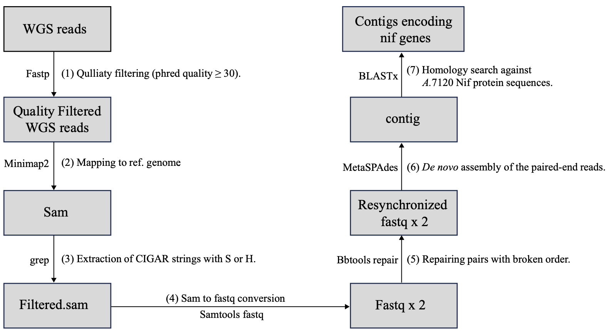

## Supporting data for the nif gene cluster reconstitution in the Nitrogen-Fixing Cyanobacterium Calothrix sp. NIES-4101. 
  
   
This repository includes:  
  - Sanger reads that sequenced PCR fragments amplified between nifH1DKB genes from heterocyst induced cells.  
  - The clipped paired-end sequencing reads.   
  - Raw contig sequences assembled from clipped paired-end sequencing reads (the schematic workflow is shown in Fig. 1).   
  - Direct link for DDBJ sequencing archive and NSSS.   
  - Code for reconstruction of the nif gene clusters (in preparation).  

### 1: Sanger reads that sequenced PCR fragments amplified between nifH1DKB genes from heterocyst induced cells.  
All ABI formated Sanger sequeincg reads are stored in each directory.  
  
### 2-3: Clipped paired-end sequencing reads and raw contig sequences.   
Two fastq files; R1_clipped.fq.gz and R2_clipped.fq.gz, are partially aligned (not globally) reads against vegetative cell assembly. contig.fasta is a raw assembly from clipped paired-end reads using MetaSPAdes.
  
### 4: Link for DDBJ sequencing archive and NSSS.   
BioProject <PRJDB16824>: https://ddbj.nig.ac.jp/resource/sra-experiment/DRX491938  
BioSample <SAMD00651075>: https://ddbj.nig.ac.jp/resource/sra-run/DRR508037  
DRA Run for WGS reads <DRR508037>: https://ddbj.nig.ac.jp/resource/sra-run/DRR508037  
NSSS for restored nif-cluster <LC785442>: https://getentry.ddbj.nig.ac.jp/getentry/na/LC785442/?format=flatfile&filetype=html&trace=true&show_suppressed=false&limit=10

    

Fig.1 The schematic workflow for assembling reconstituted nif genes from bulk short read sequencing. 

## Citation  
Kazuma Uesaka, Mari Banba, Sotaro Chiba,  Yuichi Fujita; Restoration of the Functional nif Gene Cluster by Seven Excision and Two Inversion Events during Heterocyst Development in the Nitrogen-Fixing Cyanobacterium Calothrix sp. NIES-4101  
Posted in BioRxiv in December 12, 2023  
doi: https://doi.org/10.1101/2023.12.11.571196
 
## Contact
Create an issue to report
